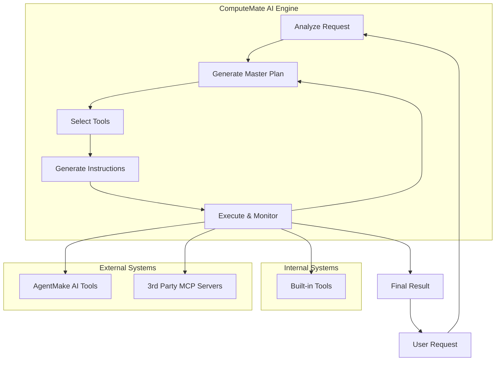

# ComputeMate AI

computemate.ai is an automation-first AI agent that takes your goals, creates a structured plan, and executes it by orchestrating multiple tools. It goes beyond conversation—delivering real results.

*   **Execute**: Automatically carry out tasks from start to finish.
*   **Orchestrate**: Seamlessly coordinate multiple tools and APIs.
*   **Automate**: Save time and effort by letting computemate.ai handle complex workflows.

[](https://opensource.org/licenses/MIT)
[](https://www.python.org/downloads/)


For professionals, teams, and innovators who need more than just chat-based AI, computemate.ai is an intelligent automation agent that plans, coordinates, and executes tasks across multiple tools. Unlike basic AI chatbots, computemate.ai doesn’t just answer—it gets things done.

### Key Differentiators

*   Built on the [agentmake.ai](https://github.com/eliranwong/agentmake) framework, proven through [LetMeDoIt.AI](https://github.com/eliranwong/letmedoit), [ToolMate.AI](https://github.com/eliranwong/toolmate) and [TeamGen AI](https://github.com/eliranwong/teamgenai).
*   Execution-focused, not just advisory.
*   Flexible integration with existing tools and APIs.
*   Scalable from individual users to enterprise workflows.
*   **Versatile** – supports 16 AI backends and numerous models, leveraging the advantages of AgentMake AI.
*   **Extensible** – capable of extending functionalities by interacting with Additional AgentMake AI tools or third-party MCP (Modal Context Protocol) servers.

## ComputeMate AI Agentic Workflow

1.  **ComputeMate AI** receives a request from a user.
2.  **ComputeMate AI** analyzes the request and determines that it requires multiple steps to complete.
3.  **ComputeMate AI** generates a `Master Prompt` that outlines the steps needed to complete the request.
4.  **ComputeMate AI** sends the `Master Prompt` to a supervisor agent, who reviews the prompt and provides suggestions for improvement.
5.  **ComputeMate AI** sends the suggestions to a tool selection agent, who selects the most appropriate tools for each step of the `Master Prompt`.
6.  **ComputeMate AI** sends the selected tools and the `Master Prompt` to an instruction generation agent, who converts the suggestions into clear and concise instructions for an AI assistant to follow.
7.  **ComputeMate AI** sends the instructions to an AI assistant, who executes the instructions using the selected tools. When the selected tool is not an internal tool, built in with ComputeMate AI, ComputeMate AI calls the external tool via interacting with the MCP (Modal Context Protocol) servers, configured by users.
8.  **ComputeMate AI** monitors the progress of the AI assistant and provides additional suggestions or instructions as needed.
9.  Once all steps are completed, **ComputeMate AI** provides a concise summary of the results to the user.
10. The user receives the final response, which fully resolves their original request.

### Workflow Diagram



## Install

```bash
pip install --upgrade computemate
```

### Extra

To support Google Vertex AI, install with:

```bash
pip install --upgrade "computemate[genai]"
```

### For Developer

> pip install -e .

### Quick Start

Run commands either `computemate` or `cpm`.

> computemate

or

> cpm

After `ComputeMate AI` is launched, enter your request in the ComputeMate AI prompt.

Remarks: `ComputeMate AI` allows you to execute system commands directly. Simply prefix your commands with `!` or `!!`. Use `!` to integrate the command output into the ongoing conversation and to track any changes in the directory. Use `!!` when you prefer not to include the output or track directory changes.

### CLI Options

> computemate -h

## 🗣️ AI Modes

You can select between three AI modes to suit your preferences:

*   **Chat mode** – Provides direct text responses without using tools, ideal for simple queries.
*   **Agent mode** – A fully autonomous agent designed to plan, orchestrate tools, and take multiple actions to address user requests.
*   **Partner mode** – A semi-automated mode that involves you in the process with review and edit prompts, giving you more control over the AI's actions.

`Partner mode` is set as the default on fresh installation.

To switch between modes, use the `.mode` command in the ComputeMate AI prompt. This will open a selection dialog where you can choose your preferred mode.


## ⚙️ Configure AI Backend

After ComputeMate AI is launched, enter:

> .backend

A text editor is opened for you to edit the AgentMake AI settings. Change the `DEFAULT_AI_BACKEND` to your own choice of AI backend and enter API keys where appropriate.

You may override the default AI backend temporarily by using the CLI option `-b` or `--backend`. For example,

> computemate -b groq

Read AI backend setup examples at https://github.com/eliranwong/computemate/tree/main/docs/setup_ai_backends

## Configure MCP Servers

Enter `.mcp` in ComputeMate AI prompt.

Three MCP servers are available in the following example, you can add more to meet your needs.

```
{
    # Check configuration format at https://gofastmcp.com/clients/client#configuration-format
    #
    # Example - Online Search Utilities; Perplexica setup is required; read https://github.com/eliranwong/computemate/blob/main/docs/setup_others/online_searches.md
    # Uncomment the following line to use it, i.e. remove the `#` symbol
    "online": {"command": "python", "args": [os.path.join(COMPUTEMATE_PACKAGE_PATH, "mcp", "online_searches.py")]},
    #
    # Example - Youtube Utilities; Installation of `ffmpeg` is required; read https://github.com/eliranwong/computemate/blob/main/docs/setup_others/ffmpeg.md
    # Uncomment the following line to use it, i.e. remove the `#` symbol
    "youtube": {"command": "python", "args": [os.path.join(COMPUTEMATE_PACKAGE_PATH, "mcp", "youtube.py")]},
    #
    # Example - GitHub MCP
    # Export your GITHUB_TOKEN, e.g. `export GITHUB_TOKEN=xxxxxxxxxxxxxx`
    # Uncomment the following 4 lines to use it
    "github": {
        "url": "https://api.githubcopilot.com/mcp",
        "headers": {"Authorization": os.getenv("GITHUB_TOKEN")},
    },
}
```

Some MCP servers in the example require extra setup, read https://github.com/eliranwong/computemate/tree/main/docs/setup_others

## Configure Available Tools

Enter `.tools` in ComputeMate AI prompt.

Select / deselect to enable / disable tools.


## 🏃 Action Menu

| Command              | Description                        |
|----------------------|------------------------------------|
| `.new`               | New conversation                   |
| `.exit`              | Quit ComputeMate AI                  |
| `.backend`           | Change backend                     |
| `.mode`              | Change AI mode                     |
| `.tools`             | List available tools               |
| `.plans`             | List available plans               |
| `.resources`         | List available resources           |
| `.editprompt`        | Edit current prompt                |
| `.backup`            | Backup conversation                |
| `.reload`            | Reload current conversation        |
| `.edit`              | Edit current conversation          |
| `.trim`              | Trim current conversation          |
| `.import`            | Import conversation                |
| `.export`            | Export conversation                |
| `.find`              | search conversation                |
| `.content`           | Show current directory content     |
| `.directory`         | Change directory                   |
| `.open`              | Open file or directory             |
| `.ideas`             | Generate ideas                     |
| `.autosuggest`       | Toggle auto input suggestions      |
| `.autoprompt`        | Toggle auto prompt engineering     |
| `.autotool`          | Toggle auto tool selection         |
| `.autocorrect`       | Toggle auto code correction        |
| `.lite`              | Toggle lite context                |
| `.steps`             | Set max number of steps            |
| `.matches`           | Set max number of semantic matches |
| `.download`          | Download data files                |
| `.help`              | Show help page                     |

### Remarks:

* Use `.lite` to enable or disable lite context. When lite context is enabled, ComputeMate runs faster, with a slight trade‑off in tool response quality.
* To use `.import`, you need to specify a python file that contains a saved conversation.  Conversation is saved into a file each time when a backup is executed. Check the message `Conversation backup saved to ...` or locate the backups in `~/agentmake/xomate`. Instead of loading a mere conversation, you can load both a conversation and its master plan. To do so, specify a backup directory path that contains both `conversation.py` and `master_plan.md`.
* To use `.open`, you need to specify a file or a directory that is to be opened.
* `.edit` command allows you to edit the current conversation with our built-in text editor.  You may customize to use your favorite text editor. Enter `.backend` and change the value of `DEFAULT_TEXT_EDITOR` with a command that calls your favorite text editor.
* Use `.autosuggest` to toggle auto input suggestions. If disabled, you can use `TAB` key to open input suggestions menu.
* Use `.reload` to reload the last saved conversation, if any.  It is useful for continuing an unfinished agentic flow after a conversation was broken for any reasons.
* Command `.matches` works for local MCP connection only.  It doesn't apply to remote MCP connection, as the changes in local settings does not affect the settings in remote servers.

## ⌨️ Keyboard Shortcuts

The following key bindings are supported in ComputeMate AI prompt field:

- `Ctrl+Y`: help info
- `Ctrl+S` or `Esc+ENTER` or `Alt+ENTER`: submit input
- `Ctrl+N`: new conversation
- `Esc+I`: import conversation
- `Esc+O`: edit conversation
- `Ctrl+O`: edit input in text editor
- `Ctrl+Q`: exit input
- `Ctrl+R`: reset input
- `Ctrl+Z`: undo input changes
- `Ctrl+W`: save prompt / plan
- `Esc+W`: delete prompt / plan
- `Ctrl+L`: open prompt / plan
- `Esc+L`: search prompt / plan
- `Ctrl+F`: search conversation
- `Ctrl+J`: change AI mode
- `Ctrl+G`: toggle auto input suggestions
- `Esc+G`: generate ideas for prompts to try
- `Ctrl+P`: toggle auto prompt engineering
- `Esc+P`: improve prompt content
- `Esc+T`: toggle auto tool selection in chat mode
- `Ctrl+C`: change directory
- `Esc+C`: show current directory content
- `Ctrl+D`: delete
- `Ctrl+H`: backspace
- `Ctrl+W`: delete previous word
- `Ctrl+U`: kill text until start of line
- `Ctrl+K`: kill text until end of line
- `Ctrl+A`: go to beginning of line
- `Ctrl+E`: go to end of line
- `Ctrl+LEFT`: go to one word left
- `Ctrl+RIGHT`: go to one word right
- `Ctrl+UP`: scroll up
- `Ctrl+DOWN`: scroll down
- `Shift+TAB`: insert four spaces
- `TAB` or `Ctrl+I`: open input suggestion menu
- `Esc`: close input suggestion menu

Common shortcuts on Terminal Apps:

- `Ctrl+Shift+C`: Copy
- `Ctrl+Shift+V`: Paste

## 🛠️ Customization

ComputeMate AI is highly customizable. Advanced users can modify existing tools, create new ones, and even change the behavior of the AI agent by customizing system prompts.

Custom files are placed in the `computemate` sub-directory within the AgentMake user directory (typically `~/.agentmake/computemate` on Linux/macOS or `%USERPROFILE%\.agentmake\computemate` on Windows).

### Frequently Used Prompts and Plans

You can save, search, open or delete frequently used prompts and plans.

For examples:

* Enter a prompt and use `Ctrl+W` to save a prompt.
* Prefix a prompt with `@@` and use `Ctrl+W` to save a prompt.
* Use `Esc+W` to delete a saved prompt / plan.
* Use `Ctrl+L` to open a prompt / plan.
* Use `Esc+L` to search for prompts / plans.

### Override system prompts

The agent's core logic is guided by system prompts, which are markdown files. You can override them by placing your own versions in `~/.agentmake/systems/computemate/`.

The customizable system prompt files are: `supervisor.md`, `tool_instruction.md`, and `tool_selection.md`. You can copy them from the `computemate/systems` directory in the package installation folder to your user directory and modify them as needed.

### Add or Modify Tools & Plans

You can add your own tools and built-in plans (prompts) by creating a custom `computemate_mcp.py` file.

1.  First, locate the built-in `computemate_mcp.py` file inside the `computemate` package installation directory.
2.  Copy this file to your user customization directory at `~/.agentmake/computemate/computemate_mcp.py`.
3.  Now you can edit this file to add or modify tools and prompts using the `fastmcp` syntax. ComputeMate AI will automatically load your custom file instead of the built-in one.

## ✒️ Built-in Text Editor


You can edit current prompt with our built-in text editor, by either enter `.editprompt` or pressing `Ctrl+O` in the ComputeMate AI prompt field.

You can also launch the built-in editor on its own by running `etextedit`.

You can use plugins that built with ComputeMate AI and AgentMake AI in our built-in text editor `etextedit`.

Plugins `Extract Bible References` and `Insert Bible Text` are installed with ComputeMate AI.

You may also add you own `etextedit` plugins and place them into `~/etextedit/plugins`.

Read more about `etextedit` at https://github.com/eliranwong/etextedit 

## Export to DOCX or PDF [Optional]

`etextedit` offers options for exporting content into DOCX and PDF files.

- `pandoc` is required to export content to DOCX format. To install, for example, on Debian/Ubuntu:

> sudo apt install pandoc

- `pdflatex` is required to export content to PDF format. To install, for example, on Debian/Ubuntu:

> sudo apt install texlive-full

## Third-Party Text Editor [Optional]

You can use a third-party text editor of your own choice. Enter `.backend` in the ComputeMate AI prompt and specify the value of `DEFAULT_TEXT_EDITOR` with a command that calls your favorite text editor, e.g. `micro -softwrap true -wordwrap true`. To use the built-in text editor `etextedit` for making changes, you simply need one step, i.e. either save `Ctrl+S` or exit `Ctrl+Q`, to return to the ComputeMate AI prompt. With third-party text editor, however, you need to save the changes first before exiting.

## License

This project is licensed under the MIT License - see the [LICENSE](LICENSE) file for details.
