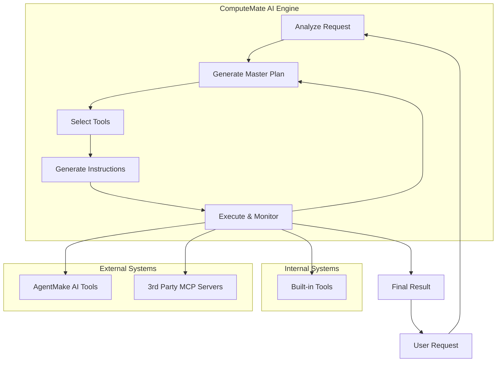

# ComputeMate AI

> eXecute. Orchestrate. Automate.

**ComputeMate.AI is your autonomous execution engine—automating planning, orchestration, and execution of tasks using multiple tools to resolve user requests seamlessly.**

[](https://opensource.org/licenses/MIT)
[](https://www.python.org/downloads/)

For professionals, teams, and innovators who need more than just chat-based AI, computemate.ai is an intelligent automation agent that plans, coordinates, and executes tasks across multiple tools. Unlike basic AI chatbots, computemate.ai doesn’t just answer—it gets things done.

## Core Messaging

computemate.ai is an automation-first AI agent that takes your goals, creates a structured plan, and executes it by orchestrating multiple tools. It goes beyond conversation—delivering real results.

### Value Propositions

*   **Execute**: Automatically carry out tasks from start to finish.
*   **Orchestrate**: Seamlessly coordinate multiple tools and APIs.
*   **Automate**: Save time and effort by letting computemate.ai handle complex workflows.

### Key Differentiators

*   Built on the [agentmake.ai](https://github.com/eliranwong/agentmake) framework, proven through [LetMeDoIt.AI](https://github.com/eliranwong/letmedoit), [ToolMate.AI](https://github.com/eliranwong/toolmate) and [TeamGen AI](https://github.com/eliranwong/teamgenai).
*   Execution-focused, not just advisory.
*   Flexible integration with existing tools and APIs.
*   Scalable from individual users to enterprise workflows.
*   **Versatile** – supports 16 AI backends and numerous models, leveraging the advantages of AgentMake AI.
*   **Extensible** – capable of extending functionalities by interacting with Additional AgentMake AI tools or third-party MCP (Modal Context Protocol) servers.

## ComputeMate AI Agentic Workflow

1.  **ComputeMate AI** receives a request from a user.
2.  **ComputeMate AI** analyzes the request and determines that it requires multiple steps to complete.
3.  **ComputeMate AI** generates a `Master Prompt` that outlines the steps needed to complete the request.
4.  **ComputeMate AI** sends the `Master Prompt` to a supervisor agent, who reviews the prompt and provides suggestions for improvement.
5.  **ComputeMate AI** sends the suggestions to a tool selection agent, who selects the most appropriate tools for each step of the `Master Prompt`.
6.  **ComputeMate AI** sends the selected tools and the `Master Prompt` to an instruction generation agent, who converts the suggestions into clear and concise instructions for an AI assistant to follow.
7.  **ComputeMate AI** sends the instructions to an AI assistant, who executes the instructions using the selected tools. When the selected tool is not an internal tool, built in with ComputeMate AI, ComputeMate AI calls the external tool via interacting with the MCP (Modal Context Protocol) servers, configured by users.
8.  **ComputeMate AI** monitors the progress of the AI assistant and provides additional suggestions or instructions as needed.
9.  Once all steps are completed, **ComputeMate AI** provides a concise summary of the results to the user.
10. The user receives the final response, which fully resolves their original request.

### Workflow Diagram



## Development in Progress

1.  Agentic workflow developed and tested.
2.  Core code built for the agentic workflow.
3.  Tested with AgentMake AI MCP servers.

### Pending

*   [ ] Build an action plan agent to handle random requests.
*   [ ] Refine code and improve effectiveness.
*   [ ] Test with third-party systems.
*   [ ] Select frequently used AgentMake AI tools to include in the main library as built-in tools.
*   [ ] Build CLI/TUI interfaces.
*   [ ] Build a web UI.
*   [ ] Test on Windows, macOS, Linux, and ChromeOS.
*   [ ] Test on Android mobile devices.

### Custom Features

*   [ ] options to unload some or all built-in tools
*   [ ] custom ComputeMate AI system prompts
*   [ ] edit master plan
*   [ ] iteration allowance
*   [ ] change tools
*   [ ] three modes: chat, light, full

... more ...

## Install

```bash
pip install --upgrade computemate
```

### Extra

To support Google Vertex AI, install with:

```bash
pip install --upgrade "computemate[genai]"
```

# Configure MCP Servers

Enter `.mcp` in ComputeMate AI prompt.

## License

This project is licensed under the MIT License - see the [LICENSE](LICENSE) file for details.
